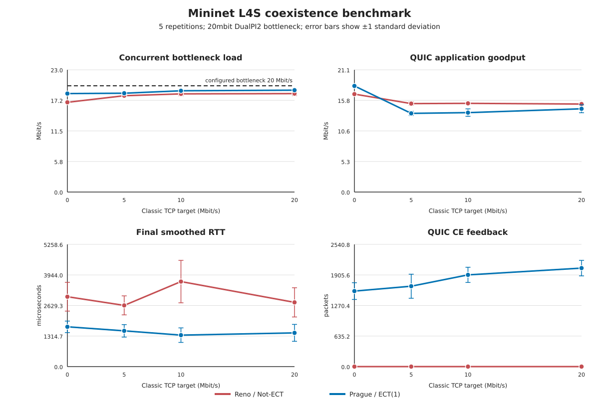

# Mininet L4S coexistence benchmark

Run the benchmark from the host with:

```sh
make l4s-mininet-benchmark-check
```

The command boots an ephemeral overlay of `~/sandbox/p4/work.qcow2`, builds the
committed IMQUIC and picoquic revisions inside it, and creates this Mininet
topology:

```text
client --- s1 (Open vSwitch, HTB 20 Mbit/s + DualPI2) --- server
```

The same IMQUIC transfer runs with Prague/ECT(1) (`l4s-on`) and Reno/Not-ECT
(`l4s-off`). At the same time, iperf3 sends paced TCP from client to server with
TCP ECN disabled. The default requested TCP rates are 0, 5, 10, and 20 Mbit/s,
and every load/mode combination runs five times. Each case recreates both
switch-port qdiscs so counters do not leak between runs. The analyzer separates
QUIC (`udp.port == 4443`) from background TCP (`tcp.port == 5201`) and fails if
the classic flow carries ECN marks, if an off run emits ECT(1), if an on run
lacks ECT(1)/CE evidence, or if either mode never reaches 70% bottleneck
utilization.

The concurrent-load measurement sums client-to-server QUIC and TCP IP bytes
captured during the exact QUIC wall-clock interval. This avoids combining QUIC
goodput with an iperf3 average measured over a different duration. The generated
SVG plots mean values with one-standard-deviation error bars and draws the
configured capacity directly on the concurrent-load panel.

## Latest default run

Kernel: `5.15.72-48b3db6b4-prague-111`; Mininet: `2.3.1b4`; transfer: 4 MiB;
five repetitions per point (40 cases total). Values are mean ± sample standard
deviation.

| TCP target (Mbit/s) | Concurrent load off/on (Mbit/s) | QUIC goodput off/on (Mbit/s) | Final RTT off/on (us) | Prague CE feedback |
|---:|---:|---:|---:|---:|
| 0 | 16.89±0.20 / 18.53±0.21 | 16.92±0.10 / 18.34±0.03 | 3008±618 / 1712±248 | 1570±174 |
| 5 | 18.13±0.20 / 18.60±0.20 | 15.29±0.31 / 13.59±0.36 | 2634±409 / 1539±268 | 1671±251 |
| 10 | 18.47±0.35 / 19.05±0.16 | 15.32±0.15 / 13.72±0.64 | 3659±913 / 1354±313 | 1907±158 |
| 20 | 18.52±0.37 / 19.17±0.17 | 15.21±0.19 / 14.39±0.68 | 2764±630 / 1452±364 | 2048±161 |



The matched-interval link load reached 90.6--92.6% of the bottleneck for Reno
and 92.6--95.9% for Prague at nonzero background loads. At a 20 Mbit/s request,
classic TCP averaged only 14.14 Mbit/s with Reno QUIC and 14.34 Mbit/s with
Prague QUIC, making the shared capacity constraint explicit. Prague's mean
final smoothed RTT was lower at all four loads, while its mean QUIC goodput was
lower at the three nonzero loads. These are experiment observations, not a
general performance claim or a significance test.

Across all 40 cases, classic TCP had zero ECN-marked packets and all Reno runs
had zero ECT(1)/CE feedback. Every Prague run had ECT(1), capture-visible CE,
DualPI2 CE marks, and QUIC ACK ECN feedback.

Override the matrix without editing scripts:

```sh
make l4s-mininet-benchmark-check \
  L4S_BENCHMARK_RATES=2,8,14,18 \
  L4S_BENCHMARK_BYTES=8388608 \
  L4S_BENCHMARK_BOTTLENECK=20mbit \
  L4S_BENCHMARK_SECONDS=12 \
  L4S_BENCHMARK_REPETITIONS=5
```

The command produces `summary.csv`, `aggregate.csv`, `analysis.json`, and
`comparison.svg` automatically. Full CSV trajectories, iperf JSON, qdisc
counters, logs, and pcaps are copied to
`results/l4s/qemu-mininet-benchmark-<timestamp>/`, which is ignored by Git.
